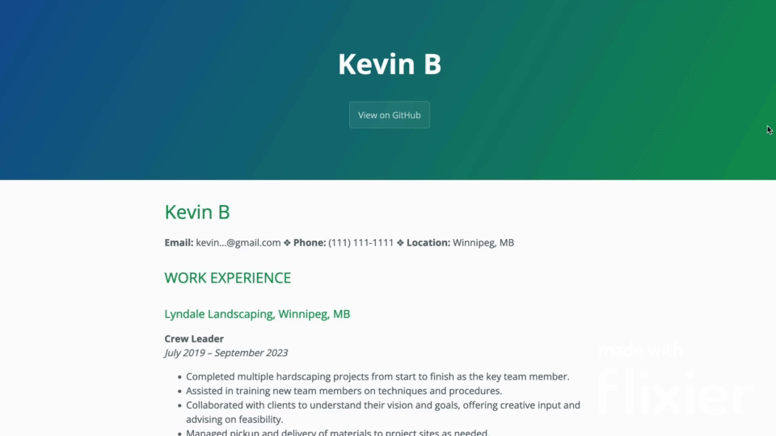

# Hosting Your Resume Online with GitHub Pages

## Purpose
- Go through the steps needed to host your resume online with GitHub Pages.
-  Relate these steps to the general principles of current Technical Writing, as explained in Andrew Etter's book Modern Technical Writing.

## Prerequisites

- A resume written in markdown. A tutorial to markdown can be found under [More Resources](#more-resources).
- A GitHub account for hosting your resume online.

## Instructions

### Step 1: Setup Your GitHub Repository

- This approach aligns with Etter's recommendation to use a distributed version control system. While his advice primarily targets documentation stored alongside code, applying it to hosting resumes on GitHub Pages similarly embraces the use of modern, developer-preferred tools. 

1. Click the icon in the top right of your screen to go to your GitHub profile.
2. Click **Your Repositories**.
3. Click the green **New** button.
4. Enter the name for your repository. Your repository must be named ```<username>.github.io``` (e.g., if your username is anonUser you would name your repository ```anonUser.github.io```)
5. Set the repository to public.
6. Check the box to initialize with a README file.
7. Click **Create repository**.

### Step 2: Upload Your Resume to Your Repository

- This aligns with Etter's recommendation of using Markdown for simple websites, like hosting a resume. Markdown is portable and web compatable, makign it a perfect choice for a simple website such as this.

1. Click **Add file** in the **Code** section of your repository.
2. Click **Upload files**.
3. Drag and drop your Markdown resume. Make sure to name the file `index.md` so that GitHub automatically identifies it as the homepage.
4. Click **Commit changes** at the bottom of the screen.


### Step 3: Enable GitHub Pages

- This aligns with Etter's preference for static websites. As he states in his book, static websites are simple, portable, and secure. Using GitHub Pages enables anyone with a computer to host their own website without any complex servers.

1. Click **Settings** while in your repository.
2. Click **Pages** under the **Code and Automation** section.
3. Open the Branch dropdown menu, currently set to **None**.
4. Set the branch to **Main**.
5. Click **Save**.
6. GitHub Pages will now build your site. When the site is ready a link will appear at the top of the page. Note that it will take a few minutes to build the site so make sure to refresh the page.

### Step 4: Customize Your Page with Jekyll (Optional)
- This aligns with Etter's preference for static site generators. By using Jekyll, one of his recommended generators, it's simple to customize the site's appearance.
1. Navigate to your repositories files by selecting **Code** from the menu bar at the top of the page.
2. Click **Add file**.
3. Click **Create new file**.
4. Name the file `_config.yml`.
5. In the body of `_config.yml` copy & paste the following:

    ```yaml
    theme: jekyll-theme-YOUR_THEME_NAME
    ```
    replace YOUR_THEME_NAME with a theme of your choosing (e.g., theme: jekyll-theme-cayman). A list of available themes is provided in the [More Resources](#more-resources) section below. For themes with spaces in their names, use hyphens (e.g., theme: jekyll-theme-leap-day).

6. Click **Commit changes**
7. Click **Commit changes** again in the additional popup prompt. It will take a few minutes for this theme to take effect.

### Site Preview
After completing these steps you should have something that looks like this:



## More Resources
- [Markdown tutorial](https://docs.github.com/en/get-started/writing-on-github/getting-started-with-writing-and-formatting-on-github/basic-writing-and-formatting-syntax)
- [What is markdown](https://www.markdownguide.org/getting-started/)
- [Common markdown editors](https://blog.hubspot.com/website/wysiwyg-markdown-editor)
- [What is GitHub Pages](https://docs.github.com/en/pages/getting-started-with-github-pages/about-github-pages)
- [Jekyll themes](https://pages.github.com/themes/)

## Authors and Acknowledgements
- Kevin Breckman.
- Cayman Theme: The Jekyll theme used in the GIF can be found [here](https://github.com/pages-themes/cayman).

## FAQs
1. Why is Markdown better than a word processor?
    - Human Readability: Markdown is easily readable as plain text.
    - Portable: Cross compatable with MacOS, Windows, Linux, etc.
    - Web compatability: Can easily be converted to HTML, allowing for easy web publishing.

2. Why is my resume not showing up?
    - Ensure that your file is named `index.md`. GitHub will look for a file with this name to set as the homepage. Additionally, ensure that your file is at the root of your repository.
 
